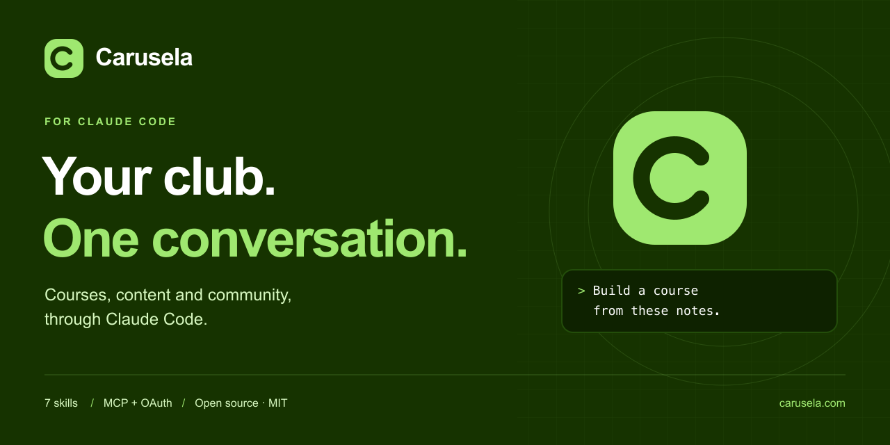

[](https://carusela.com)

# Carusela for Claude Code

[](LICENSE)
[](#install)
[](https://carusela.com)

[Install](#install) · [Skills](#why-a-plugin-and-not-just-the-mcp) · [Safety](#safety) · [Contributing](#contributing)

Run your [Carusela](https://carusela.com) club from Claude Code. Build courses, upload a library,
brand the club, set access tiers, build sales pages and funnels and configure its AI mentor, by
talking to Claude.

## Install

```
/plugin marketplace add Carusela/carusela-plugin
/plugin install carusela@carusela
```

Both are typed **inside Claude Code**, not in a terminal. The MCP connection comes with the
plugin, so there is no server address to paste and no token to copy. The first time you ask
Claude to do something in your club, a browser opens and you approve it with the Carusela
account that owns the club. Once.

## Why a plugin and not just the MCP

The connection on its own gives Claude the tools. It does not tell Claude how the surface is
shaped, so it guesses, and several of the natural guesses are quietly wrong: content created live
when you wanted a draft, a category that looks attached and is not, a tier that does not exist.

The seven skills are the part that stops that.

| skill | what it is for |
|---|---|
| `club-orientation` | the map, and which refusals are correct so Claude stops trying to route around them |
| `seed-club-content` | importing or bulk-creating content without losing fields or publishing early |
| `brand-a-club` | colours, logo, favicon and social card, published in the call you ask for them |
| `gate-club-access` | what each access tier reaches |
| `build-sales-funnel` | offers, coupons, a sales page (blocks, your own designed HTML page, or your own site) and its funnel, live when you ask for them and one request away from the previous version |
| `audit-club-content` | what got created successfully and is still invisible |
| `tune-club-mentor` | making the club's AI assistant answer from your own material |

They load from their descriptions, so in practice you say what you want. You can also name one:
"use audit-club-content".

## What it will not do

Prices, offers, coupons, trials, instalments and member tiers decide money and access. When you
ask for one, Claude stages it and applies it in the same turn: your request is the approval, with
no token and no second confirmation call. If you left the price open, Claude asks for it rather
than inventing one. Sales pages, funnels and A/B tests go live the same way, and you can ask to see
a sales page or a funnel first. Claude never charges or refunds a member, and it cannot connect
your CardCom terminal: you do that yourself in the admin, under payments.

Two writes still wait for your yes: an email to real people, after Claude tells you how many
recipients it reaches, and a migration import, whose plan you approve in the admin.

Feature flags are yours to switch in the admin under "יכולות הקהילה", and the navigation rail is
edited in the admin as well. Claude does neither.

There are no repository, deploy, DNS or domain tools here, and Carusela stores no such
credentials. Claude Code may already hold your own GitHub and Vercel sessions on your machine;
those never enter this connection.

## Safety

Every call is written to your club's audit log with `source: "mcp"`, including the ones that
failed and the arguments they carried, with email addresses redacted. Ask Claude to "show the
audit log".

Design, commercial, sales page and funnel changes apply in the call that makes them, and the
result says what changed, from what to what. Every design, sales page and funnel publish is kept
as a version. A sales page or a funnel goes back to an earlier version in one request. A design
goes back when Claude applies the previous values again, or from the versions screen in your club
admin. A price or an offer goes back when Claude stages the previous values and applies them.

Member names, email addresses and phone numbers come back only from the member tools, such as
`list_members` and `get_member`, which only the club's owner and admins can use. Member statistics
are counts only.

## Requirements

- [Claude Code](https://claude.com/claude-code)
- A Carusela club, and the platform account that owns it

## Contributing

Found a missing workflow or an unclear instruction? [Open an issue](https://github.com/Carusela/carusela-plugin/issues)
with what you asked Claude to do and what you expected. Leave out tokens, member data and
private club content.

Skill improvements and documentation fixes are welcome as pull requests. Each skill lives in
[`plugins/carusela/skills`](plugins/carusela/skills). Keep changes focused, and keep the skills in
step with the server: add no approval step it does not have, and keep the two it does, an email's
recipient count and a migration plan.

For articles, demos and integrations, the [brand assets](assets/brand) include the logo,
wordmark, banner source and a social preview image.

## Licence

MIT. See [LICENSE](LICENSE).
